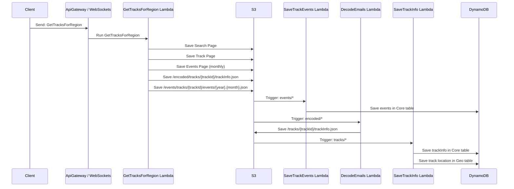

# Crawler Service

The Crawler Service is a distributed web crawler that pulls public BMX data. Below is a high level sequence diagram of how the process works.

## Crawler Process Overview

The process is kicked off by a Lambda Function fired from an API Gateway WebSocket request then uses S3 triggers that fire Lambda Functions.

The Crawler works by downloading a search result page to S3 and then processes the page. Individual track pages are also downloaded as well as individual calendar pages for those tracks. These HTML pages are parsed and the output is saved in json format in an S3 bucket. Several S3 triggers are in place that process the json files as they are saved in S3. This results in a distributed crawler setup where Lambda functions are fired and run concurrently to process each track. Currently there is no management tool in place for this but logs show it takes roughly 3 to 4 seconds to download and process ~5 tracks and their events for 1 month.

## Crawler Process Details
There are 4 Lambda functions that do the work
* GetTracksForRegion (.net core 6)
* DecodeEmails (python 3.8)
* SaveTrackInfo (node 18 / TypeScript)
* SaveTrackEvents (node 18 / TypeScript)

The GetTracksForRegion Lambda kicks off the process and does the work of downloading the raw HTML pages into S3, processing these pages, and saving trackInfo.json and event json files. This Lambda Function does the bulk of the work and runs in roughly 2-3 seconds.

Email addresses are encodedd using webscrapping protection 😏... so we decode these email addressses using a one liner python call. An S3 trigger is in place to fire when any file hits the `encoded/` path in our S3 bucket. The DecodeEmails Lambda Function saves the trackInfo.json file in the `tracks/` path in the S3 bucket.

The `tracks/` path has a trigger in place which fires the SaveTrackInfo Lambda. This function loads the trackInfo.json file and saves the data to both the Core and Geo table in DynamoDB.

The Geo table is a GeoHash lookup enabled table we can use to store points that we want to perform geo searches on. In our case we are interested in types of events (Gold Cup Races) at tracks that are "near" us.

When the events json files are saved to the `events/` path in S3 the SaveTrackEvents Lambda Function fires and saves each event into the Core DynamoDB table.
